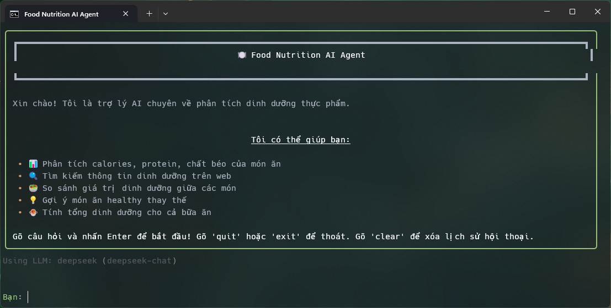
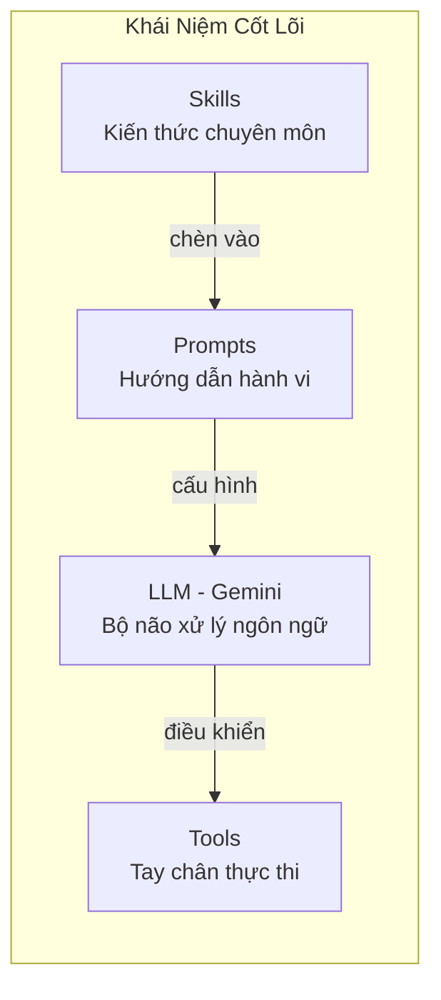
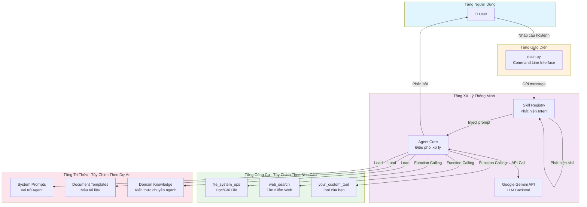
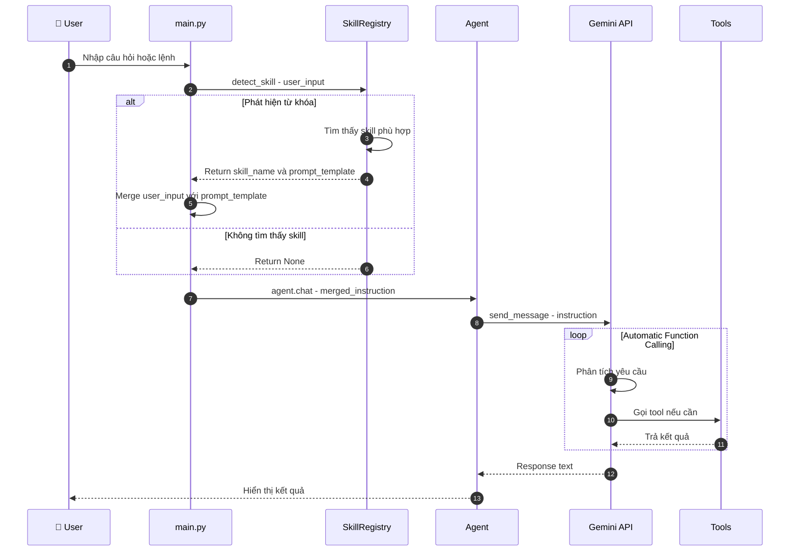
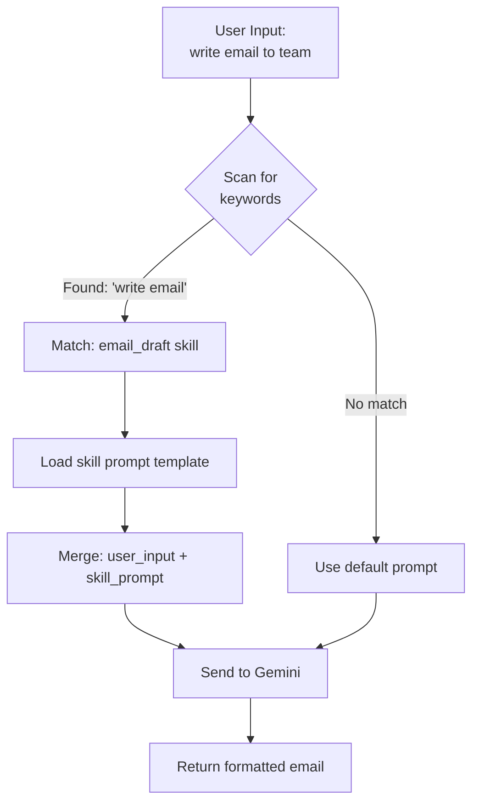
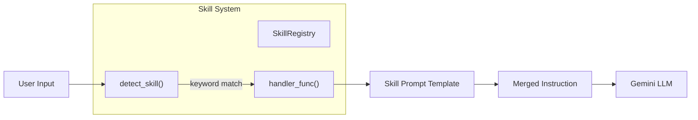
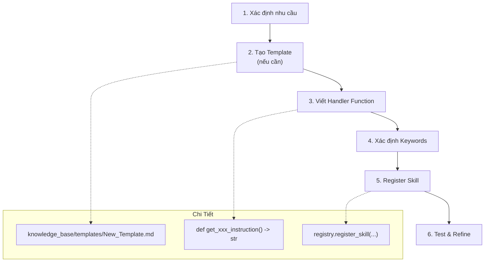

# 🍽️ Food Nutrition AI Agent

<p align="center">
  
</p>

AI Agent chuyên phân tích dinh dưỡng thực phẩm, tính toán calories, protein, chất béo và cung cấp tư vấn chế độ ăn.

## ✨ Tính năng

- 📊 **Phân tích dinh dưỡng**: Tính calories, protein, chất béo, carbs của món ăn
- 🔍 **Web Search**: Tìm kiếm thông tin dinh dưỡng trên internet
- 🥗 **So sánh món ăn**: So sánh giá trị dinh dưỡng giữa các món
- 💡 **Gợi ý healthy**: Đề xuất món ăn thay thế lành mạnh hơn
- 🍲 **Tính tổng bữa ăn**: Tính dinh dưỡng cho cả bữa ăn nhiều món
- 🤖 **Multi-LLM**: Hỗ trợ Deepseek, Claude, OpenAI

## 🚀 Cài đặt

### 1. Clone và cài đặt dependencies

```bash
# Clone source
git clone https://github.com/khoidh24/nutrion-ai.git
cd nutrion-ai

# Tạo virtual environment (khuyến nghị)
python -m venv venv

# Kích hoạt virtual environment
# Windows:
venv\Scripts\activate
# Linux/Mac:
source venv/bin/activate

# Cài đặt dependencies
pip install -r requirements.txt
```

### 2. Cấu hình environment

```bash
# Rename file cấu hình
# Windows:
rename env.example.txt .env
# Linux/Mac:
mv env.example.txt .env

# Chỉnh sửa file .env và thêm API keys
```

### 3. Cấu hình API Keys

Mở file `.env` và thêm:

```env
# BẮT BUỘC: API Key của LLM
MODEL_API_KEY=your_api_key_here

# Tùy chọn: Provider (deepseek/claude/openai)
LLM_PROVIDER=deepseek

# Tùy chọn: API Key cho web search
SERPER_API_KEY=your_serper_key_here
```

**Lấy API Keys:**
- Deepseek: https://platform.deepseek.com/
- Claude: https://console.anthropic.com/
- OpenAI: https://platform.openai.com/
- Serper (Web Search): https://serper.dev/ (2500 free/tháng)

## 🎮 Sử dụng

### Chạy Agent

```bash
python main.py
```

### Ví dụ câu hỏi

```
Bạn: Phân tích dinh dưỡng phở bò

🤖 AI Agent:
## 🍜 Phở Bò

### 📊 Thông tin dinh dưỡng (khẩu phần 500g)
| Chỉ số | Giá trị |
|--------|---------|
| 🔥 Calories | 450 kcal |
| 💪 Protein | 25g |
| 🧈 Fat | 12g |
| 🍚 Carbs | 55g |
...
```

### Các lệnh đặc biệt

- `quit` / `exit` / `q`: Thoát chương trình
- `clear`: Xóa lịch sử hội thoại

## 📁 Cấu trúc Project

```
deepshiet/
├── agent_core/           # Core AI Agent logic
│   ├── __init__.py
│   ├── agent.py          # Main agent class
│   ├── exceptions.py     # Custom exceptions
│   └── tools.py          # Web search & nutrition tools
├── knowledge_base/       # Prompts và templates
│   ├── prompts/
│   │   └── SYSTEM_PROMPT.md
│   └── templates/
│       └── TEMPLATE.md
├── skills/               # Agent skills
│   ├── __init__.py
│   ├── registry.py       # Skill registry
│   └── food_analysis.py  # Food analysis skills
├── config.py             # Configuration management
├── main.py               # Entry point
├── requirements.txt      # Dependencies
├── env.example.txt       # Example environment config
└── README.md
```

## 🔧 Cấu hình nâng cao

### Thay đổi LLM Provider

```env
# Sử dụng Claude
LLM_PROVIDER=claude
MODEL_API_KEY=sk-ant-...

# Sử dụng OpenAI
LLM_PROVIDER=openai
MODEL_API_KEY=sk-...

# Sử dụng Deepseek (mặc định)
LLM_PROVIDER=deepseek
MODEL_API_KEY=sk-...
```

### Tùy chỉnh Model

```env
# Deepseek
LLM_MODEL=deepseek-chat

# Claude
LLM_MODEL=claude-3-5-sonnet-20241022

# OpenAI
LLM_MODEL=gpt-4o
```

### Tùy chỉnh Generation

```env
# Số token tối đa
LLM_MAX_TOKENS=4096

# Temperature (0.0 = focused, 1.0 = creative)
LLM_TEMPERATURE=0.7
```

## 🛠️ Mở rộng

### Thêm skill mới

```python
# skills/my_skill.py
from .registry import registry

@registry.register(
    name="my_skill",
    description="Mô tả skill",
    examples=["Ví dụ 1", "Ví dụ 2"],
    tags=["tag1", "tag2"]
)
async def my_skill(param: str) -> dict:
    # Implementation
    pass
```

### Thêm tool mới

Chỉnh sửa `agent_core/tools.py` và thêm vào `AVAILABLE_TOOLS`.

# 🤖 Hướng Dẫn Toàn Diện: Xây Dựng Hệ Thống AI Agent Từ Đầu

> 📌 **Lưu ý quan trọng:** Tài liệu này hướng dẫn cách **xây dựng hệ thống AI Agent độc lập**, có thể áp dụng cho **bất kỳ dự án nào** - không yêu cầu phụ thuộc vào bất kỳ codebase cụ thể nào.

---

## 📑 Mục Lục

1. [Giới Thiệu Tổng Quan](#1-giới-thiệu-tổng-quan)
2. [Kiến Trúc Hệ Thống](#2-kiến-trúc-hệ-thống)
3. [Yêu Cầu Môi Trường](#3-yêu-cầu-môi-trường)
4. [Hướng Dẫn Xây Dựng Từ Đầu](#4-hướng-dẫn-xây-dựng-từ-đầu)
5. [Cấu Hình Nâng Cao](#5-cấu-hình-nâng-cao)
6. [Hướng Dẫn Sử Dụng](#6-hướng-dẫn-sử-dụng)
7. [Tham Khảo: Danh Sách Công Cụ (Tools)](#7-tham-khảo-danh-sách-công-cụ-tools)
8. [Tham Khảo: Hệ Thống Kỹ Năng (Skills)](#8-tham-khảo-hệ-thống-kỹ-năng-skills)
9. [Mở Rộng Hệ Thống](#9-mở-rộng-hệ-thống)
10. [Xử Lý Sự Cố](#10-xử-lý-sự-cố)
11. [FAQ - Câu Hỏi Thường Gặp](#11-faq---câu-hỏi-thường-gặp)
12. [Phụ Lục: Code Mẫu Hoàn Chỉnh](#12-phụ-lục-code-mẫu-hoàn-chỉnh)

---

## 1. Giới Thiệu Tổng Quan

### 1.1. Hệ Thống AI Agent Là Gì?

Hệ thống **AI Agent** là một **trợ lý ảo có tính tự chủ cao (Agentic AI)**, được thiết kế để:

- 🧠 **Hiểu ngữ cảnh** thông qua Mô hình Ngôn ngữ Lớn (LLM - Google Gemini).
- 🔧 **Thực thi hành động** bằng các công cụ (Tools) như đọc/ghi file, tìm kiếm web.
- 🎯 **Chuyên môn hóa** thông qua hệ thống Kỹ năng (Skills) tự động kích hoạt theo ngữ cảnh.

### 1.2. Tại Sao Cần Hệ Thống Này?

| Vấn Đề Hiện Tại | Giải Pháp Của Agent |
|-----------------|---------------------|
| Viết tài liệu mất nhiều thời gian | Tự động generate theo template chuẩn công ty |
| Thiếu đồng bộ format giữa các team | Skills đảm bảo output luôn đúng chuẩn |
| Tra cứu thông tin rời rạc | Tích hợp web search + local files |
| Phụ thuộc vào "người biết làm" | AI học từ knowledge base, ai cũng dùng được |

### 1.3. Các Khái Niệm Cốt Lõi



**Giải thích:**

| Khái Niệm | Định Nghĩa | Ví Dụ |
|-----------|------------|-------|
| **LLM** | Large Language Model - Bộ não chính xử lý ngôn ngữ | Google Gemini, OpenAI GPT |
| **Tools** | Các hàm Python mà Agent có thể gọi khi cần | Đọc file, Tìm kiếm web |
| **Skills** | Chế độ chuyên gia được kích hoạt bởi từ khóa | "Viết Proposal" → Template Proposal |
| **Prompts** | System Instructions quy định vai trò Agent | "Bạn là Senior BA..." |

---

## 2. Kiến Trúc Hệ Thống

### 2.1. Sơ Đồ Kiến Trúc Tổng Thể (Generic Architecture)



### 2.2. Luồng Xử Lý Yêu Cầu (Request Flow)



### 2.3. Cấu Trúc Thư Mục Đề Xuất (Cho Dự Án Mới)

```
your_ai_agent_project/
│
├── 📄 main.py                      # Entry point - Khởi động Agent
├── 📄 requirements.txt             # Danh sách thư viện Python
├── 📄 .env.example                 # Mẫu cấu hình environment
├── 📄 .env                         # [CẦN TẠO] API Keys của bạn
├── 📄 .gitignore                   # Ignore .env và cache
│
├── 📁 agent_core/                  # Lõi xử lý Agent
│   ├── 📄 __init__.py
│   ├── 📄 agent.py                 # Class Agent chính
│   ├── 📄 tools.py                 # Định nghĩa tất cả Tools
│   └── 📄 exceptions.py            # Custom Exceptions
│
├── 📁 skills/                      # Hệ thống Kỹ năng
│   ├── 📄 __init__.py
│   ├── 📄 registry.py              # SkillRegistry class
│   └── 📄 your_skills.py           # Đăng ký skills của bạn
│
├── 📁 knowledge_base/              # Tri thức của Agent
│   ├── 📁 prompts/                 # System Instructions
│   │   └── 📄 SYSTEM_PROMPT.md     # Prompt chính
│   └── 📁 templates/               # Document Templates
│       └── 📄 Your_Template.md     # Template của bạn
│
└── 📄 config.py                    # Cấu hình toàn cục
```

---

## 3. Yêu Cầu Môi Trường

### 3.1. Phần Mềm Bắt Buộc

| Phần Mềm | Phiên Bản Tối Thiểu | Mục Đích | Link Tải |
|----------|---------------------|----------|----------|
| **Python** | 3.8+ | Ngôn ngữ runtime | [python.org](https://www.python.org/downloads/) |
| **pip** | 21.0+ | Quản lý thư viện | Đi kèm Python |
| **Git** | 2.30+ (tùy chọn) | Quản lý source code | [git-scm.com](https://git-scm.com/downloads) |

### 3.2. API Keys Cần Thiết

| API Key | Bắt Buộc | Mục Đích | Cách Lấy |
|---------|----------|----------|----------|
| **GOOGLE_API_KEY** | ✅ Có | Truy cập Gemini LLM | [Google AI Studio](https://aistudio.google.com/app/apikey) |
| **TAVILY_API_KEY** | ❌ Không | Tìm kiếm web (nếu cần) | [tavily.com](https://tavily.com/) |

### 3.3. Thư Viện Python Tối Thiểu

```text
# === REQUIRED ===
google-generativeai>=0.3.0    # Gemini SDK - bắt buộc
python-dotenv>=1.0.0          # Đọc file .env - bắt buộc

# === OPTIONAL (thêm nếu cần) ===
asteval>=0.9.31               # Safe math evaluation
tavily-python>=0.3.0          # Web search API
requests>=2.28.0              # HTTP requests
```

---

## 4. Hướng Dẫn Xây Dựng Từ Đầu

> 🎯 **Mục tiêu:** Sau phần này, bạn sẽ có một AI Agent hoạt động được mà **KHÔNG cần clone bất kỳ repository nào**.

### Bước 1: Tạo Thư Mục Dự Án

```bash
# Tạo thư mục mới
mkdir my_ai_agent
cd my_ai_agent

# Tạo cấu trúc thư mục
mkdir agent_core skills knowledge_base
mkdir knowledge_base/prompts knowledge_base/templates
```

### Bước 2: Tạo Virtual Environment

**Windows (PowerShell/CMD):**
```powershell
python -m venv .venv
.venv\Scripts\activate
```

**macOS / Linux:**
```bash
python3 -m venv .venv
source .venv/bin/activate
```

### Bước 3: Tạo File requirements.txt

```bash
# Tạo file requirements.txt
```

Nội dung file `requirements.txt`:
```text
google-generativeai>=0.3.0
python-dotenv>=1.0.0
```

Cài đặt:
```bash
pip install -r requirements.txt
```

### Bước 4: Tạo File Cấu Hình

#### 4.1. File `.env.example`
```ini
# Google Gemini API Configuration
# Get your API key from: https://aistudio.google.com/app/apikey
GOOGLE_API_KEY=your_api_key_here

# Optional: Gemini Model Selection
GEMINI_MODEL=gemini-2.0-flash-lite
```

#### 4.2. File `.env` (Copy từ example và điền key)
```ini
GOOGLE_API_KEY=AIzaSyD_YOUR_ACTUAL_KEY_HERE
GEMINI_MODEL=gemini-2.0-flash-lite
```

#### 4.3. File `.gitignore`
```text
.env
.venv/
__pycache__/
*.pyc
```

#### 4.4. File `config.py`
```python
import os
from pathlib import Path
from dotenv import load_dotenv

# Load environment variables
load_dotenv()

# Paths
PROJECT_ROOT = Path(__file__).parent
KNOWLEDGE_BASE_DIR = PROJECT_ROOT / "knowledge_base"
PROMPTS_DIR = KNOWLEDGE_BASE_DIR / "prompts"
TEMPLATES_DIR = KNOWLEDGE_BASE_DIR / "templates"

# API Configuration
GOOGLE_API_KEY = os.getenv("GOOGLE_API_KEY")
GEMINI_MODEL = os.getenv("GEMINI_MODEL", "gemini-2.0-flash-lite")
```

### Bước 5: Tạo Agent Core

#### 5.1. File `agent_core/__init__.py`
```python
from .agent import Agent
from .exceptions import AgentError, ToolError
```

#### 5.2. File `agent_core/exceptions.py`
```python
class AgentError(Exception):
    """Base exception for Agent errors."""
    pass

class ToolError(AgentError):
    """Exception for tool execution errors."""
    pass

class ValidationError(AgentError):
    """Exception for validation errors."""
    pass
```

#### 5.3. File `agent_core/tools.py`
```python
"""
Định nghĩa các Tools cho Agent.
Mỗi tool là một hàm Python với docstring mô tả rõ ràng.
Gemini sẽ đọc docstring để biết cách sử dụng tool.
"""
import os
from pathlib import Path
from .exceptions import ToolError, ValidationError

# Document root for file operations
DOC_ROOT = Path.cwd()

def set_doc_root(path: str):
    """Set the root directory for file operations."""
    global DOC_ROOT
    DOC_ROOT = Path(path)
    print(f"[INFO] Document root set to: {DOC_ROOT}")

def file_system_ops(operation: str, file_path: str, content: str = None) -> str:
    """
    Performs file operations.
    
    Args:
        operation: 'read', 'write', 'append', or 'list'
        file_path: Relative path to file or directory
        content: Content for write/append operations
        
    Returns:
        str: Operation result or file contents
    """
    full_path = (DOC_ROOT / file_path).resolve()
    
    # Security: Ensure path is within DOC_ROOT
    try:
        full_path.relative_to(DOC_ROOT.resolve())
    except ValueError:
        raise ValidationError(f"Path traversal detected: {file_path}")
    
    try:
        if operation == "read":
            if not full_path.exists():
                return f"Error: File '{file_path}' does not exist"
            with open(full_path, "r", encoding="utf-8") as f:
                return f.read()
                
        elif operation == "write":
            if not content:
                return "Error: 'content' is required for write operation"
            full_path.parent.mkdir(parents=True, exist_ok=True)
            with open(full_path, "w", encoding="utf-8") as f:
                f.write(content)
            return f"Success: File '{file_path}' written."
            
        elif operation == "append":
            if not content:
                return "Error: 'content' is required for append operation"
            with open(full_path, "a", encoding="utf-8") as f:
                f.write("\n" + content)
            return f"Success: Content appended to '{file_path}'."
            
        elif operation == "list":
            if not full_path.is_dir():
                return f"Error: '{file_path}' is not a directory"
            items = [item.name for item in full_path.iterdir()]
            return str(items)
            
        else:
            return f"Error: Invalid operation '{operation}'. Use 'read', 'write', 'append', or 'list'."
            
    except Exception as e:
        raise ToolError(f"File operation failed: {str(e)}")

def simple_calculator(expression: str) -> str:
    """
    Evaluates a simple mathematical expression safely.
    
    Args:
        expression: Mathematical expression (e.g., "2 + 2", "100 * 1.1")
        
    Returns:
        str: Calculation result
        
    Note:
        Only supports basic arithmetic: +, -, *, /, (, )
    """
    # Simple safe evaluation using eval with restricted globals
    allowed_chars = set("0123456789+-*/().% ")
    if not all(c in allowed_chars for c in expression):
        return "Error: Expression contains invalid characters"
    
    try:
        result = eval(expression, {"__builtins__": {}}, {})
        return f"Result: {result}"
    except Exception as e:
        return f"Error: {str(e)}"

# List of all tools to register with Gemini
TOOLS_LIST = [
    file_system_ops,
    simple_calculator,
]
```

#### 5.4. File `agent_core/agent.py`
```python
"""
Core Agent class - Kết nối với Gemini API và quản lý Tools.
"""
import os
import logging
import google.generativeai as genai
from dotenv import load_dotenv

from .tools import TOOLS_LIST
from .exceptions import AgentError

# Configure logging
logging.basicConfig(
    level=logging.INFO,
    format='[%(levelname)s] %(name)s: %(message)s'
)
logger = logging.getLogger(__name__)

# Load environment
load_dotenv()

class Agent:
    """AI Agent powered by Google Gemini with Tool capabilities."""
    
    def __init__(self, system_instruction: str, tools: list = None):
        """
        Initialize the Agent.
        
        Args:
            system_instruction: System prompt defining agent behavior
            tools: Optional list of tools (uses default if None)
        """
        self.system_instruction = system_instruction
        
        # Get API key
        api_key = os.getenv("GOOGLE_API_KEY")
        if not api_key:
            raise AgentError(
                "GOOGLE_API_KEY not found. "
                "Please set it in your .env file."
            )
        
        # Configure Gemini
        genai.configure(api_key=api_key)
        
        # Get model name
        model_name = os.getenv("GEMINI_MODEL", "gemini-2.0-flash-lite")
        
        # Use provided tools or default
        self.tools = tools if tools else TOOLS_LIST
        
        try:
            # Initialize model with tools
            self.model = genai.GenerativeModel(
                model_name=model_name,
                tools=self.tools,
                system_instruction=system_instruction
            )
            
            # Start chat session with automatic function calling
            self.chat_session = self.model.start_chat(
                enable_automatic_function_calling=True
            )
            
            logger.info(f"Agent initialized with model: {model_name}")
            
        except Exception as e:
            raise AgentError(f"Failed to initialize Gemini: {str(e)}")
    
    def chat(self, user_input: str) -> str:
        """
        Send a message to the agent and get a response.
        
        Args:
            user_input: User's message
            
        Returns:
            str: Agent's response
        """
        try:
            response = self.chat_session.send_message(user_input)
            return response.text
            
        except Exception as e:
            error_msg = f"Error: {str(e)}"
            logger.error(error_msg)
            return error_msg
```

### Bước 6: Tạo Hệ Thống Skills

#### 6.1. File `skills/__init__.py`
```python
from .registry import SkillRegistry, registry
```

#### 6.2. File `skills/registry.py`
```python
"""
SkillRegistry - Hệ thống phát hiện và kích hoạt Skills theo từ khóa.
"""
from typing import Callable, Dict, Optional, Tuple

class SkillRegistry:
    """Registry to manage Agent Skills and detect user intent."""
    
    def __init__(self):
        self._skills: Dict[str, Dict] = {}
    
    def register_skill(
        self, 
        name: str, 
        keywords: list, 
        handler_func: Callable[[], str],
        description: str = ""
    ):
        """
        Register a new skill.
        
        Args:
            name: Unique skill name
            keywords: List of trigger keywords
            handler_func: Function that returns the skill's prompt template
            description: Short description for logging
        """
        self._skills[name] = {
            "keywords": [k.lower() for k in keywords],
            "handler": handler_func,
            "description": description
        }
    
    def detect_skill(self, user_input: str) -> Optional[Tuple[str, str]]:
        """
        Scan user input for keywords and return matching skill.
        
        Returns:
            Tuple (skill_name, prompt_template) or None
        """
        user_input_lower = user_input.lower()
        
        for name, data in self._skills.items():
            for keyword in data["keywords"]:
                if keyword in user_input_lower:
                    return name, data["handler"]()
        
        return None
    
    def list_skills(self) -> Dict[str, str]:
        """Return dict of skill names and descriptions."""
        return {
            name: data["description"] 
            for name, data in self._skills.items()
        }

# Global singleton instance
registry = SkillRegistry()
```

#### 6.3. File `skills/your_skills.py` (Ví dụ mẫu)
```python
"""
Định nghĩa và đăng ký các Skills cho Agent của bạn.
Tùy chỉnh theo nhu cầu dự án!
"""
from pathlib import Path
from .registry import registry

# Path to templates
TEMPLATES_DIR = Path(__file__).parent.parent / "knowledge_base" / "templates"

def load_template(filename: str) -> str:
    """Load a template file."""
    path = TEMPLATES_DIR / filename
    if path.exists():
        return path.read_text(encoding="utf-8")
    return f"[Template '{filename}' not found]"

# === SKILL HANDLERS ===

def get_meeting_notes_instruction() -> str:
    """Handler for Meeting Notes skill."""
    template = load_template("Meeting_Notes.md")
    return f"""
[SKILL ACTIVATED: MEETING NOTES]
Format your output according to this template:

--- TEMPLATE ---
{template}
--- END TEMPLATE ---

Fill in all sections based on the user's input.
"""

def get_email_draft_instruction() -> str:
    """Handler for Email Draft skill."""
    return """
[SKILL ACTIVATED: PROFESSIONAL EMAIL]
Write a professional email with:
1. Clear subject line suggestion
2. Professional greeting
3. Concise body (max 3 paragraphs)
4. Appropriate closing
5. Signature placeholder

Tone: Professional but friendly.
"""

def get_code_review_instruction() -> str:
    """Handler for Code Review skill."""
    return """
[SKILL ACTIVATED: CODE REVIEW]
Analyze the code and provide:

## Code Review Report

### 1. Summary
Brief overview of what the code does.

### 2. Strengths
- What's done well

### 3. Issues Found
| Severity | Line | Issue | Suggestion |
|----------|------|-------|------------|
| HIGH/MED/LOW | # | Description | Fix |

### 4. Recommendations
Prioritized list of improvements.
"""

# === REGISTER SKILLS ===

registry.register_skill(
    name="meeting_notes",
    keywords=["meeting notes", "ghi chú cuộc họp", "meeting summary", "tóm tắt họp"],
    handler_func=get_meeting_notes_instruction,
    description="Generates structured meeting notes"
)

registry.register_skill(
    name="email_draft",
    keywords=["write email", "draft email", "viết email", "soạn email"],
    handler_func=get_email_draft_instruction,
    description="Drafts professional emails"
)

registry.register_skill(
    name="code_review",
    keywords=["code review", "review code", "đánh giá code", "kiểm tra code"],
    handler_func=get_code_review_instruction,
    description="Provides structured code review feedback"
)

print(f"[Skills] Registered {len(registry._skills)} skills")
```

### Bước 7: Tạo Knowledge Base

#### 7.1. File `knowledge_base/prompts/SYSTEM_PROMPT.md`
```markdown
# AI AGENT - SYSTEM INSTRUCTIONS

**Role:** You are a helpful AI Assistant.

## Your Responsibilities
- Answer questions accurately and concisely
- Help with writing and editing documents
- Assist with code and technical tasks
- Use available tools when needed

## Behavior Guidelines
- Be professional but friendly
- Ask for clarification when needed
- Provide structured responses (use headers, bullet points)
- Always cite sources when using external information

## Available Tools
You have access to:
- **file_system_ops**: Read/write files in the workspace
- **simple_calculator**: Perform mathematical calculations

Use these tools automatically when the task requires them.
```

#### 7.2. File `knowledge_base/templates/Meeting_Notes.md` (Ví dụ)
```markdown
# Meeting Notes

**Date:** [Date]
**Attendees:** [List of participants]
**Duration:** [Duration]

## Agenda
1. [Topic 1]
2. [Topic 2]

## Discussion Summary
[Key points discussed]

## Action Items
| # | Task | Owner | Deadline |
|---|------|-------|----------|
| 1 | [Task] | [Name] | [Date] |

## Next Meeting
- **Date:** [Next date]
- **Topics:** [Planned topics]
```

### Bước 8: Tạo Entry Point (main.py)

```python
"""
Main entry point for the AI Agent.
Run with: python main.py
"""
from pathlib import Path

# Load configuration
from config import PROMPTS_DIR

# Import Agent
from agent_core import Agent

# Import and register skills (this triggers registration)
import skills.your_skills
from skills import registry

def load_system_prompt() -> str:
    """Load the main system prompt."""
    prompt_file = PROMPTS_DIR / "SYSTEM_PROMPT.md"
    if prompt_file.exists():
        return prompt_file.read_text(encoding="utf-8")
    return "You are a helpful AI assistant."

def main():
    print("=" * 60)
    print("🤖 AI AGENT - Starting Up...")
    print("=" * 60)
    
    # Load system prompt
    system_prompt = load_system_prompt()
    
    # Initialize Agent
    try:
        agent = Agent(system_instruction=system_prompt)
    except Exception as e:
        print(f"[ERROR] Failed to initialize agent: {e}")
        return
    
    print("\n✅ Agent is ready!")
    print("📝 Type 'help' to see available skills")
    print("🚪 Type 'exit' to quit\n")
    
    # Main loop
    while True:
        try:
            user_input = input("You: ").strip()
            
            if not user_input:
                continue
            
            if user_input.lower() in ["exit", "quit"]:
                print("👋 Goodbye!")
                break
            
            if user_input.lower() == "help":
                print("\n📚 Available Skills:")
                for name, desc in registry.list_skills().items():
                    print(f"  • {name}: {desc}")
                print("\nTip: Use keywords to activate skills automatically!\n")
                continue
            
            # Check for skill activation
            skill_match = registry.detect_skill(user_input)
            if skill_match:
                skill_name, skill_prompt = skill_match
                print(f"[🎯 Skill Activated: {skill_name}]")
                user_input = f"{user_input}\n\n{skill_prompt}"
            
            # Send to agent
            response = agent.chat(user_input)
            print(f"\n🤖 Agent:\n{response}\n")
            
        except KeyboardInterrupt:
            print("\n👋 Goodbye!")
            break

if __name__ == "__main__":
    main()
```

### Bước 9: Chạy Thử

```bash
# Đảm bảo đang trong virtual environment
(.venv) > python main.py
```

**Kết quả mong đợi:**
```
============================================================
🤖 AI AGENT - Starting Up...
============================================================
[Skills] Registered 3 skills
[INFO] agent: Agent initialized with model: gemini-2.0-flash-lite

✅ Agent is ready!
📝 Type 'help' to see available skills
🚪 Type 'exit' to quit

You: 
```

---

## 5. Cấu Hình Nâng Cao

### 5.1. Chọn Model Gemini Phù Hợp

| Model | Ưu Điểm | Nhược Điểm | Use Case |
|-------|---------|------------|----------|
| `gemini-2.0-flash-lite` | Nhanh, chi phí thấp | Độ chính xác vừa phải | Sử dụng hàng ngày |
| `gemini-1.5-flash` | Cân bằng tốc độ/chất lượng | Chi phí trung bình | Viết document quan trọng |
| `gemini-1.5-pro` | Chính xác cao nhất | Chậm, đắt | Phân tích phức tạp |
| `gemini-2.0-flash-thinking-exp` | Có khả năng suy luận | Experimental | Giải quyết vấn đề phức tạp |

Thay đổi trong `.env`:
```ini
GEMINI_MODEL=gemini-1.5-pro
```

### 5.2. Thêm Web Search (Tùy Chọn)

Nếu cần tính năng tìm kiếm web:

1. Đăng ký tại [tavily.com](https://tavily.com/) để lấy API key.
2. Thêm vào `.env`:
   ```ini
   TAVILY_API_KEY=tvly-YOUR_KEY_HERE
   ```
3. Cài thêm thư viện:
   ```bash
   pip install tavily-python
   ```
4. Thêm tool vào `agent_core/tools.py`:
   ```python
   def web_search(query: str, max_results: int = 5) -> str:
       """
       Search the web for information.
       
       Args:
           query: Search query
           max_results: Maximum number of results
           
       Returns:
           str: Formatted search results
       """
       from tavily import TavilyClient
       import os
       
       api_key = os.getenv("TAVILY_API_KEY")
       if not api_key:
           return "Error: TAVILY_API_KEY not configured"
       
       client = TavilyClient(api_key=api_key)
       response = client.search(query=query, max_results=max_results)
       
       results = []
       for i, r in enumerate(response.get('results', []), 1):
           results.append(f"{i}. {r.get('title')}\n   {r.get('url')}\n   {r.get('content', '')[:150]}...")
       
       return "\n\n".join(results) if results else "No results found"
   
   # Add to TOOLS_LIST
   TOOLS_LIST.append(web_search)
   ```

---

## 6. Hướng Dẫn Sử Dụng

### 6.1. Các Lệnh Cơ Bản

| Lệnh | Mô Tả |
|------|-------|
| `help` | Hiển thị danh sách Skills |
| `exit` hoặc `quit` | Thoát chương trình |
| *Bất kỳ câu hỏi* | Gửi đến Agent xử lý |

### 6.2. Ví Dụ Sử Dụng Skills

```
You: Please write email to inform the team about tomorrow's meeting

[🎯 Skill Activated: email_draft]

🤖 Agent:
**Subject Suggestion:** Team Meeting Tomorrow - Action Required

Dear Team,

I hope this message finds you well. I'm writing to remind everyone about our scheduled meeting tomorrow.

**Meeting Details:**
- Date: [Tomorrow's date]
- Time: [Time]
- Location: [Location/Link]

Please come prepared with your updates on current tasks. If you have any agenda items to add, please reply to this email.

Looking forward to seeing everyone there.

Best regards,
[Your Name]
```

### 6.3. Flow Diagram: Skill Activation



---

## 7. Tham Khảo: Danh Sách Công Cụ (Tools)

### 7.1. Tools Mẫu Đã Cài Đặt

| Tool | Chức Năng | Ví Dụ Prompt |
|------|-----------|--------------|
| `file_system_ops` | Đọc/Ghi/Liệt kê file | "Read the content of README.md" |
| `simple_calculator` | Tính toán cơ bản | "Calculate 15% of 2500" |

### 7.2. Ý Tưởng Tools Có Thể Thêm

| Tool Idea | Mục Đích | Thư Viện Cần |
|-----------|----------|--------------|
| `web_search` | Tìm kiếm internet | `tavily-python` |
| `send_email` | Gửi email tự động | `smtplib` (built-in) |
| `run_sql` | Query database | `sqlite3` hoặc `sqlalchemy` |
| `read_pdf` | Đọc file PDF | `pypdf` |
| `translate_text` | Dịch ngôn ngữ | API Google Translate |
| `generate_image` | Tạo hình ảnh | Gemini Vision API |

---

## 8. Tham Khảo: Hệ Thống Kỹ Năng (Skills)

### 8.1. Cách Skill Hoạt Động



### 8.2. Ý Tưởng Skills Có Thể Thêm

| Skill | Keywords | Mục Đích |
|-------|----------|----------|
| User Story Writer | "user story", "acceptance criteria" | Viết User Story chuẩn BABOK |
| API Documentation | "api docs", "endpoint" | Generate API documentation |
| SQL Generator | "write sql", "query" | Generate SQL từ mô tả |
| Bug Report | "bug report", "issue" | Format bug report chuẩn |
| Release Notes | "release notes", "changelog" | Generate release notes |

---

## 9. Mở Rộng Hệ Thống

### 9.1. Thêm Skill Mới: Quy Trình



### 9.2. Thêm Tool Mới: Quy Trình

1. **Viết function** trong `agent_core/tools.py`
2. **Docstring quan trọng!** - Gemini đọc docstring để hiểu cách dùng
3. **Thêm vào `TOOLS_LIST`**
4. **Restart Agent**

**Template cho Tool mới:**
```python
def your_new_tool(required_param: str, optional_param: int = 10) -> str:
    """
    Brief description of what this tool does.
    
    Args:
        required_param: Explain what this parameter is for
        optional_param: Explain optional parameter, default is 10
        
    Returns:
        str: Description of what the tool returns
        
    Example:
        your_new_tool("hello", 5) -> "Processed: hello with 5"
    """
    # Your logic here
    result = f"Processed: {required_param} with {optional_param}"
    return result

# Don't forget to add to TOOLS_LIST!
TOOLS_LIST.append(your_new_tool)
```

---

## 10. Xử Lý Sự Cố

### 10.1. Bảng Lỗi Thường Gặp

| Lỗi | Nguyên Nhân | Giải Pháp |
|-----|-------------|-----------|
| `GOOGLE_API_KEY not found` | Chưa tạo/sai file .env | Tạo `.env` với key đúng |
| `ModuleNotFoundError` | Chưa cài dependencies | `pip install -r requirements.txt` |
| `API quota exceeded` | Hết quota miễn phí | Chờ reset hoặc nâng cấp plan |
| `Invalid API key` | Key sai hoặc bị revoke | Tạo key mới tại AI Studio |
| `Tool not found` | Chưa thêm vào TOOLS_LIST | Kiểm tra `tools.py` |

### 10.2. Debug Mode

Thêm logging chi tiết:
```python
# Trong config.py hoặc đầu main.py
import logging
logging.basicConfig(level=logging.DEBUG)
```

### 10.3. Kiểm Tra Nhanh

```bash
# 1. Kiểm tra Python version
python --version

# 2. Kiểm tra packages
pip list | grep google

# 3. Kiểm tra .env
python -c "from dotenv import load_dotenv; load_dotenv(); import os; print('Key found!' if os.getenv('GOOGLE_API_KEY') else 'Key NOT found')"

# 4. Test Gemini connection
python -c "import google.generativeai as genai; genai.configure(api_key='YOUR_KEY'); print(genai.GenerativeModel('gemini-2.0-flash-lite').generate_content('Hello').text)"
```

---

## 11. FAQ - Câu Hỏi Thường Gặp

### Q1: Có thể dùng với OpenAI GPT thay vì Gemini không?
**A:** Có, nhưng cần thay đổi `agent.py` để dùng OpenAI SDK. Concept tương tự.

### Q2: Agent có nhớ context giữa các session không?
**A:** Mặc định không. Để lưu context, cần implement persistence (database/file).

### Q3: Có thể deploy lên server không?
**A:** Có. Wrap `Agent` class trong FastAPI/Flask để tạo API endpoint.

### Q4: Chi phí Gemini API?
**A:** Gemini có free tier rộng rãi (~50 requests/minute). Xem [Google AI Pricing](https://ai.google.dev/pricing).

### Q5: Làm sao để Agent truy cập internet an toàn?
**A:** Sử dụng Tavily API (đã có sẵn trong ví dụ) thay vì cho Agent truy cập trực tiếp.

---

## 12. Phụ Lục: Code Mẫu Hoàn Chỉnh

### 12.1. Checklist Triển Khai Nhanh

- [ ] Tạo thư mục dự án
- [ ] Tạo virtual environment (`.venv`)
- [ ] Tạo `requirements.txt` và cài dependencies
- [ ] Tạo `.env` với `GOOGLE_API_KEY`
- [ ] Tạo `config.py`
- [ ] Tạo `agent_core/` (agent.py, tools.py, exceptions.py)
- [ ] Tạo `skills/` (registry.py, your_skills.py)
- [ ] Tạo `knowledge_base/prompts/SYSTEM_PROMPT.md`
- [ ] Tạo `main.py`
- [ ] Chạy `python main.py` và test

### 12.2. Download/Copy Script Tự Động

Để tự động tạo toàn bộ cấu trúc, bạn có thể tạo script `setup_agent.py`:

```python
#!/usr/bin/env python3
"""
Script tự động tạo cấu trúc AI Agent project.
Chạy: python setup_agent.py
"""
import os
from pathlib import Path

# [Copy nội dung các file từ Bước 4-8 vào đây]
# Hoặc download từ gist/repo mẫu

print("✅ AI Agent project structure created!")
print("Next steps:")
print("1. Create .env with your GOOGLE_API_KEY")
print("2. Run: pip install -r requirements.txt")
print("3. Run: python main.py")
```

### 12.3. Tài Liệu Tham Khảo

| Tài Liệu | Link |
|----------|------|
| Google Gemini API Docs | [ai.google.dev/docs](https://ai.google.dev/docs) |
| Gemini Function Calling | [ai.google.dev/docs/function_calling](https://ai.google.dev/docs/function_calling) |
| Python-dotenv | [pypi.org/project/python-dotenv](https://pypi.org/project/python-dotenv/) |
| Mermaid Syntax (v8.8.0) | [mermaid.js.org](https://mermaid.js.org/intro/) |

---

> **📝 Ghi chú:** 
> - Tài liệu này sử dụng Mermaid syntax v8.8.0 compatible. Tất cả diagram đã được test và hoạt động với các renderer phổ biến.
> - Tài liệu này là nền tảng để bạn hiểu rõ hơn tôi đã làm gì trong source code kia. Nếu bạn cần build 1 AI Agent cho riêng mình, hãy đọc kỹ nó và tôi tin chắc bạn sẽ làm được 1 con thậm chí còn tốt hơn tôi 🌿

